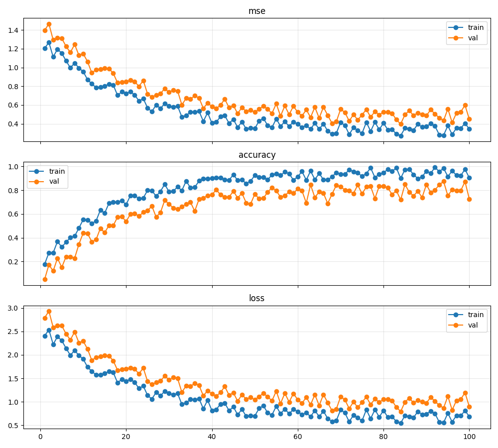

# Visualization Examples

This document showcases the different visualization capabilities of the Robot CN Network project. The visualization tools help researchers analyze training metrics, robot trajectories, and action spaces.

## Training Metrics Visualization

The `TrainingVisualizer` class provides tools for tracking and visualizing training metrics over time. This is useful for monitoring model convergence, comparing different training runs, and identifying overfitting.

### Learning Curves



The learning curves show training and validation metrics over epochs, helping you track model performance and identify overfitting or other issues during training.

### Usage Example

```python
from robot_cn_network.utils import TrainingVisualizer

# Create visualizer
visualizer = TrainingVisualizer("./outputs/experiment1", "my_experiment")

# Log metrics during training
for epoch in range(100):
    train_metrics = {"loss": loss_value, "accuracy": acc_value}
    val_metrics = {"loss": val_loss, "accuracy": val_acc}
    
    visualizer.log_metrics(train_metrics, "train", epoch)
    visualizer.log_metrics(val_metrics, "val", epoch)

# Generate visualization
fig = visualizer.plot_learning_curves(interactive=True)
```

## Robot Trajectory Visualization

The `RobotTrajectoryVisualizer` class helps visualize robot end-effector trajectories in 3D space, making it easier to analyze motion patterns, task execution, and compare different policies.

### End-Effector Path

The trajectory visualization shows the path of the robot's end-effector during task execution, along with key points like start position, target objects, and waypoints.

### Usage Example

```python
from robot_cn_network.utils import RobotTrajectoryVisualizer
import numpy as np

# Create visualizer
visualizer = RobotTrajectoryVisualizer("./outputs/trajectories")

# Load trajectory data (positions shape: [timesteps, 3])
positions = np.load("trajectory_positions.npy")
target_positions = np.load("target_positions.npy")

# Generate visualization
fig = visualizer.visualize_end_effector_path(
    positions, 
    targets=target_positions,
    title="Pick and Place Trajectory"
)
```

## Action Space Analysis

Understand the distribution and patterns in robot action spaces through visualization. This is particularly useful for analyzing demonstration data, identifying biases in control, and comparing different control strategies.

### Action Distribution

The action space visualization shows the distribution of actions across different dimensions, helping identify patterns or biases in control inputs.

### Usage Example

```python
from robot_cn_network.utils import TrainingVisualizer
import numpy as np

# Create visualizer
visualizer = TrainingVisualizer("./outputs", "action_analysis")

# Load action data (shape: [n_samples, action_dim])
actions = np.load("demonstration_actions.npy")

# Generate visualization
fig = visualizer.visualize_action_space(actions)
```

## Command-line Interface

All of these visualizations can be generated using the `robot-analyze` command-line tool:

```bash
# Visualize training metrics
robot-analyze --data-path ./outputs/training/metrics.json --mode training

# Visualize robot trajectory
robot-analyze --data-path ./outputs/trajectories/episode_0.npz --mode trajectory

# Analyze action space distribution
robot-analyze --data-path ./data/demonstrations/actions.npy --mode action-space

# Compare policies
robot-analyze --mode policy-comparison --policy-paths ./policies/a ./policies/b ./policies/c
```

## Interactive vs. Static Visualizations

The visualization tools support both interactive (HTML) and static (PNG) visualizations:

- Interactive visualizations (using Plotly) allow zooming, panning, and hovering for additional information
- Static visualizations are useful for publications, documentation, and sharing
